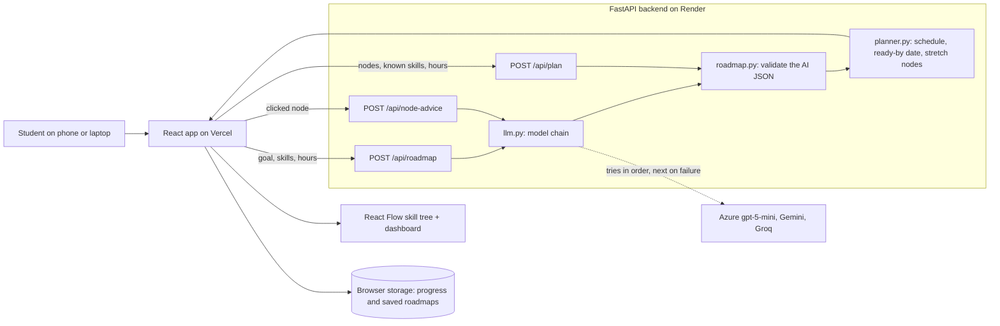

# CareerMap

## What it does

CareerMap turns a specific dream job (for example "Full Stack Developer at a climate tech startup") into an interactive skill-tree roadmap. You enter the role, the skills you already have and the hours you can study each week; the AI builds the tree, and plain code works out a live "ready by" date that updates as you change anything. Click a step to get a concrete project idea and interview questions for it.

Problem statement: **1 (Reverse-Engineered Career Roadmapper)**.

## Done / Left / Plan

_Draft: to be filled with the real status at the freeze._

## Architecture and why

Build status: the validator, the planner, the model chain and all three API routes (`/api/roadmap`, `/api/plan`, `/api/node-advice`) are built and tested with a fake AI. The web app (setup form, interactive skill tree, live ready-by date, step details) is built and checked in a desktop browser and a phone-sized window with a stand-in for the AI. The dashboard (progress ring with a phase-complete celebration, this week's focus, a 4-week timeline, hours-by-phase and path-mix charts) and the no-server share link are built too. Roadmaps are saved in a "My roadmaps" list in the browser, can be downloaded as a picture or a checklist, and progress is tracked against the real hours you finish. Deployment comes next.

How a request flows:

1. The browser sends the goal, the skills you have and your hours per week to `/api/roadmap`.
2. `llm.py` asks an AI model for a roadmap as JSON: steps, prerequisites, estimated hours, essential or optional, and which steps you already know. If a model is rate-limited or fails, the next model in the chain is tried.
3. `roadmap.py` does not trust that JSON. It keeps only valid values, drops links to steps that do not exist, breaks cycles and limits the size.
4. `planner.py` (plain Python, no AI) schedules the remaining steps in prerequisite order at your weekly hours, and calculates the ready-by date, the percentage ready, the longest chain and which optional steps no longer fit your time budget.
5. Changing hours, the weeks budget or marking a skill as known calls `/api/plan`, which runs only steps 3 and 4. It is instant and uses no AI.
6. Clicking a step calls `/api/node-advice`, which returns a project idea, interview questions and search terms for that step.

Why these choices:

- **The AI creates the roadmap; code makes the decisions.** The AI is good at knowing what a role needs. Dates, ordering and re-routing are arithmetic, so they are done in tested code. The result is explainable, instant and cheap.
- **Stateless server.** No accounts and no stored user data. Progress and saved roadmaps stay in the browser; a share link carries the roadmap in the URL.
- **A chain of models across three providers.** Each free tier has its own daily limit, so a long chain keeps the app available.
- **React Flow** for the tree because it supports zoom, pan, click and keyboard focus out of the box.
- **FastAPI + React (Vite).** Quick to build, free to host (Render and Vercel).

## What we added

_Draft: to be filled at the freeze._

## How to run it

_Draft: to be filled at the freeze (setup steps, `.env.example`, live URL)._

## Tools and AI used

_Draft: to be filled at the freeze. The app tells users that the roadmap and the advice are written by AI and should be checked._

## Who it is for

_Draft: to be filled at the freeze._
