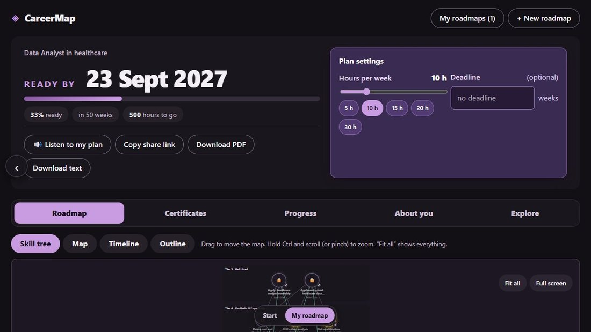
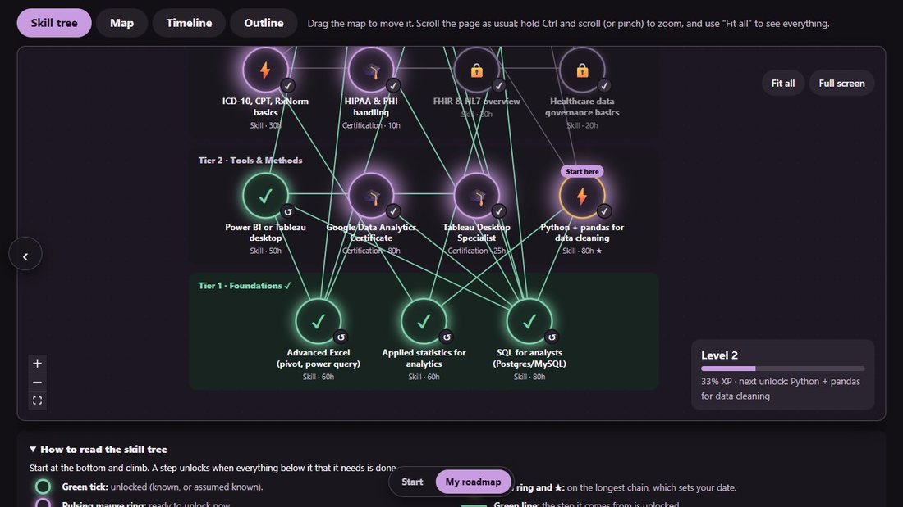
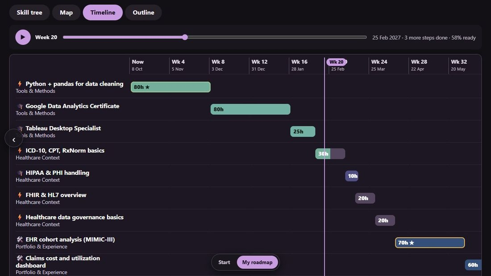
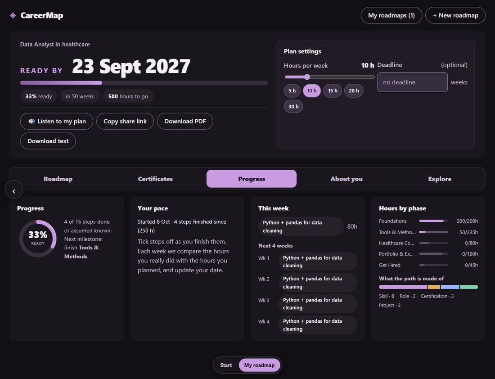
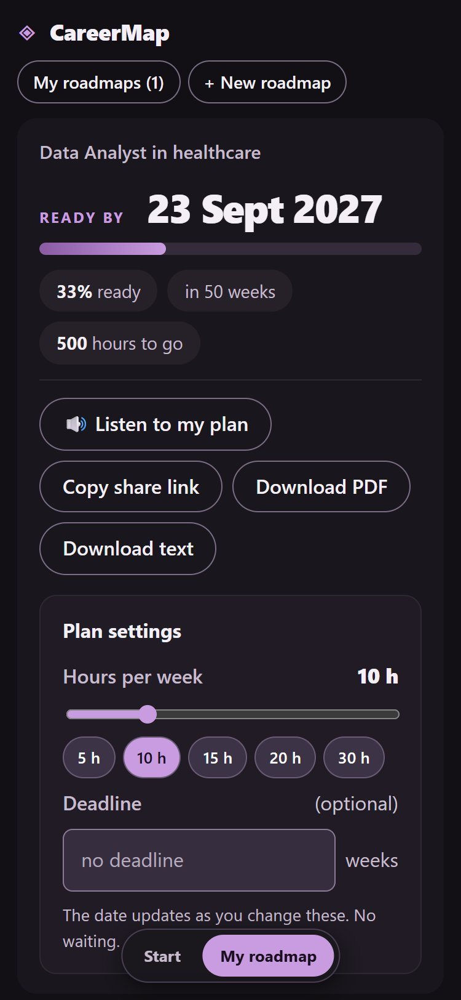
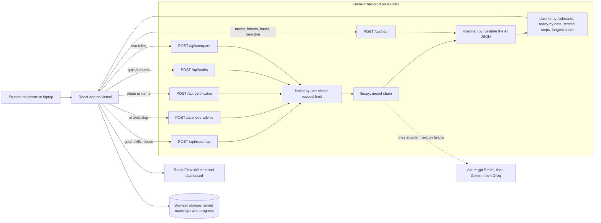

# CareerMap

**Live app:** https://careermap-neon.vercel.app · **API health check:** https://careermap-2a7e.onrender.com/health



## What it does

CareerMap turns a specific dream job (for example "UI/UX Designer for fintech apps") into an interactive skill-tree roadmap. You enter the role, the skills you already have and the hours you can study each week. An AI model builds the tree, and plain code works out a live "ready by" date that updates as you change your hours, tick off steps or add a certificate. Click any step to get a weekend project idea and interview questions for it.

Problem statement: **1 (Reverse-Engineered Career Roadmapper)**.

| The skill tree | The timeline | The dashboard | On a phone |
|---|---|---|---|
|  |  |  |  |

## Done / Left / Plan

**Done and working**
- AI-generated roadmap for any typed target job, with real tools, certifications, roles and projects. The model's answer is validated in code before it is used (no cycles, no broken links, size limits).
- Six ways to see the plan. **Skill tree**: a game-style tree of round medallions in tiers that you climb from the bottom, with locked, ready and unlocked states, power lines that light up, an unlock animation when you tick a step, and a level and XP badge. **Map**: left-to-right columns by phase. **Timeline**: weeks across the page with a bar per step, a moving "now" marker and bars that fill as you play your plan forward. **Outline**: a plain list. **Paths**: typical routes into the job. **Compare**: put two dream roles side by side (a saved roadmap or a new job) and see which steps are really the same skill, with the shared hours counted, so you can do the overlap first.
- All visual views: zoom, pan, click, keyboard focus, full screen, a "Start here" tag, and highlighting of what a step needs and unlocks. The map also has filters by type.
- "Tell us about yourself": optional dropdowns for education, year, field, projects and hackathons, plus a GitHub profile link. The AI uses the choices to skip what you already have and writes a "Where you are now" card (already have, strengthen, recommended next). The GitHub link is only kept in your browser: the app does not open it, and nothing the AI says claims to have read it. A roadmap that already exists can be rebuilt with these details from its "Add details about me" button.
- Live re-planning: hours per week, a weeks deadline and "I already know this" re-route the map and the ready-by date instantly, with no AI call.
- Per-step advice from the AI (a weekend project, interview questions, search phrases).
- Progress: percentage ready, a phase-complete celebration, this week's focus, a 4-week timeline, charts, and a pace card that compares the hours you finished with the hours you planned.
- Time travel: a slider and a Play button show which steps you would have finished by week N if you keep to the plan.
- Certificates: upload a photo or screenshot (or type a name). The AI reads it, counts matching steps as known (self-reported, not verified) and suggests careers that fit.
- "Listen to my plan": the plan read aloud with the browser's voice. If the device has no voice or the tab is muted, the app says so instead of staying silent.
- "People who took this path": three typical routes into the job, each a short timeline of roles, rough timing and side projects. They are AI-written patterns, clearly labelled as not real people, and each has a button that highlights its steps on your map.
- "My roadmaps": every roadmap is saved in the browser, with download as a picture or a PDF (or plain text) checklist, and a share link that needs no account or server storage.
- 128 automated backend tests, all passing, using a fake AI so they cost nothing.

**Left for the next 16 hours, honestly**
- Checked in desktop Chrome and in a phone-sized window. A pass on a real Android phone (touch gestures, the camera, the voice) is still to do.
- The three providers have each answered a real roadmap (Azure, Gemini and Groq); the automatic switch between them under real load has not been stress-tested.
- Certificates cannot be verified, and PDFs are not read (a screenshot works).
- The voice depends on the voices installed on the device.
- The comparison pairs steps with one AI call, so two roles with very different wording may be paired slightly differently on each try.

**Plan to finish**
1. Real-phone testing and fixes (first).
2. Exercise the fallback models, and move off the free hosting tier so the first request does not wait for the server to wake.
3. Optional accounts, so saved roadmaps follow a student across devices.

## Architecture and why



How it works:
1. The browser sends the goal, your skills and your hours to `/api/roadmap`.
2. `llm.py` asks an AI model for the roadmap as JSON. If a model is rate-limited, down or answers with unusable JSON, the next model in the chain is tried.
3. `roadmap.py` does not trust that JSON: it keeps only valid values, drops links to steps that do not exist, breaks cycles and limits the size.
4. `planner.py` (plain Python, no AI) schedules the remaining steps in prerequisite order at your weekly hours and works out the ready-by date, the percentage ready, the longest chain, and which optional steps no longer fit your deadline.
5. Changing hours, the deadline or a known step calls `/api/plan`, which runs only steps 3 and 4. It is instant and costs no AI call.
6. Certificates go to `/api/certificates`: the browser first shrinks the image (which also strips hidden metadata), the AI reads it once, and nothing is stored.

Why these choices:
- **The AI proposes, code decides.** The AI knows what a role needs. Dates, ordering and re-routing are arithmetic, so they are done in tested code. Results are explainable, instant and cheap, and a confused AI answer cannot crash the planner.
- **Stateless server.** No accounts and no stored user data. Roadmaps and progress stay in the browser. A share link carries the roadmap in the URL.
- **A chain of models across three providers.** Each free tier has its own daily limit, so a chain keeps the app available. As a last resort, if every model is busy, a saved real example is shown for the three example roles, and the screen says so.
- **A per-visitor request limit** on the AI routes protects the budget.
- **React Flow** for the map, because it gives zoom, pan, click and keyboard focus. The exported picture draws the connecting lines itself, because browsers cannot photograph thin SVG lines.
- **FastAPI and React (Vite)**: fast to build and free to host (Render and Vercel).

## What we added

Beyond the brief: a game-style skill tree with unlock animations and a level badge, a timeline view; the ready-by planner with a weekly-hours slider and deadline (optional steps become dashed "stretch" steps); live pace tracking against what you actually finished; time travel with Play; certificate reading with career suggestions; voice narration; typical routes into the job (illustrative, AI-written); saved roadmaps; downloads as a picture, a PDF and a text file; a share link; an Outline view as a plain-list alternative to the map; a legend that explains every line and colour; filters; and a phase-complete celebration. Each makes the roadmap something a student can come back to, not a one-time answer.

## How to run it

Needs Python 3.11+, Node 22+ and Git.

```bash
# backend
cd backend
python -m venv venv
source venv/bin/activate            # Windows: venv\Scripts\activate
pip install -r requirements-dev.txt
pytest                              # 83 tests, no AI key needed
cp ../.env.example .env             # then add at least one provider key
uvicorn main:app --reload           # http://localhost:8000/health

# frontend (second terminal)
cd frontend
npm install
npm run dev                         # http://localhost:5173
```

- `.env.example` lists every setting. At least one provider (`AZURE_*`, `GEMINI_*` or `GROQ_*`) needs a key, and `LLM_CHAIN` names the models in the order they are tried.
- `frontend/.env.example`: `VITE_API_URL` is the backend address (the default is `http://localhost:8000`).
- No login is needed. **Live URL:** https://careermap-neon.vercel.app. The free backend sleeps when idle, so the very first request after a quiet period can take up to a minute.
- Deploy: `render.yaml` describes the backend (Render). The frontend is a Vite app (Vercel, root directory `frontend`).

## Tools and AI used

- **Backend:** Python, FastAPI, Uvicorn, Pydantic, the OpenAI Python SDK (used as a generic client for OpenAI-compatible providers), python-dotenv, pytest, httpx.
- **Frontend:** React 19, Vite, `@xyflow/react` (React Flow), `html-to-image`, and the browser's Web Speech API for the voice.
- **Models:** Azure OpenAI `gpt-5-mini` first, then Google Gemini (`gemini-3.5-flash-lite`, `gemini-3.1-flash-lite`), then Groq (`openai/gpt-oss-20b`, `openai/gpt-oss-120b`). The same models write the roadmap, the step advice and the certificate reading.
- **AI coding assistance** was used to help write the code.
- **What users are told:** the start form says answers are sent to an AI service, so private details should be left out. Results carry plain cautions: confirm costs and requirements with official sources, routes are illustrative and not real people, and certificates are self-reported and not verified.
- **Privacy:** the server stores nothing about users. Typed goals and skills, and certificate images, are sent to an AI provider to produce the answer, and the app tells users to leave out private details and to cover their name and ID numbers on certificates. Provider terms differ: do not enter private data.

## Who it is for

Students and early-career changers who have a specific job in mind and a limited number of hours each week. They come back because the roadmap is theirs: it is saved in their browser, it re-plans when their hours or skills change, the pace card tells them whether they are on track, and each finished step moves the date closer.
